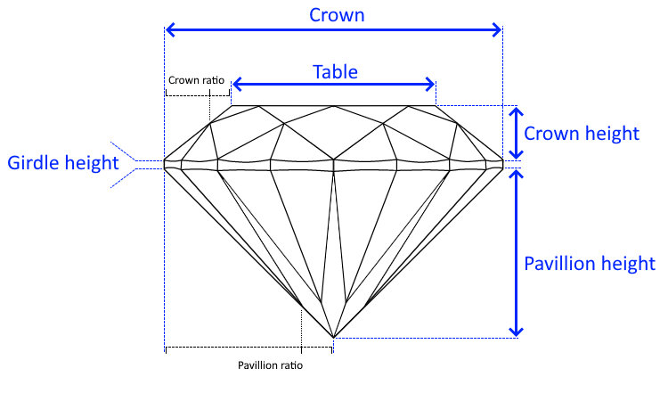
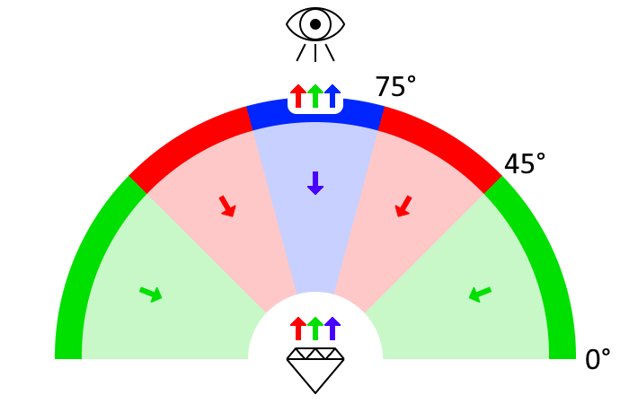
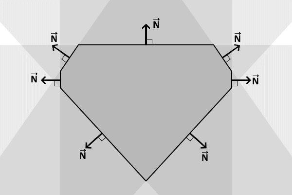
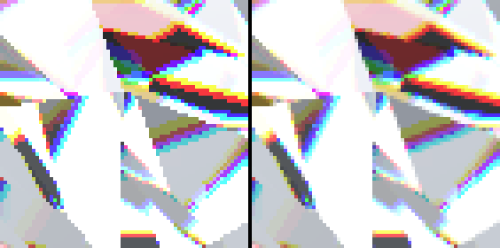

# TITLE
INTRO

See it live [here (CHANGE LINK)]().

## Description

BLABLA DESCRIPTION

## Preview
COOL IMAGES

## Diamond
### Diamond cut
The beauty of a diamond resides not only in the purity of the gem, but also in the way it is cut. The purity affects mostly light absorption, while the cut affects the way light is reflected. The goal is to reflect as much light as possible towards the viewer (that is, towards the top of the gem) so that the diamond appears the brightest.

One of the most popular diamond cuts is the brilliant cut. Subtle variations in the proportions change greatly the way light is reflected and can make the difference between a mediocre and an ideal diamond. It is described in by a few key lengths:

\
*Diagram of a round brilliant cut*

### ASET evaluation
A common tool to evaluate the quality of the diamond cut is the Angular Spectrum Evaluation Tool (ASET) image evaluation. Such an image helps to check the way the diamond gives light back (cut proportions, symmetry etc.).

\
*On the left, diamond in natural light. On the right, ASET visualization. Image credits: www.diamondbuyingadvice.com*

ASET images can either be taken with in with an ASET scope, or be computed. Here is how it is built:

\
*This is what an ASET image represents* 

On an ASET image, the blue is the light that comes directly from above, the green from the sides, and the red from between the two. The black parts are parts that don't reflect the light at all.
The ASET image of a high quality diamond should:
- be as bright as possible
- exhibit a good symmetry
- have as much red as possible
- have blue areas that are very distinct from the red and green ones. This contributes to creating good contrasts between bright and dark areas.

To generate an ASET image, orthographic projection should be used to avoid deformations due to perspective projection, especially when being too close to the gem. This project is accurate enough to generate realistic ASET images in real time. For instance, here are the visualizations of a diamond with an ideal brilliant cut, and their decomposition:

\
*Viewed from top, the arrows of the diamond are visible in the blue component of ASET*\
\
\
*Viewed from bottom, the hearts of the diamond are visible in the red component of ASET*

## Implementation details
This project uses both the rasterizer and ray tracing:
- the rasterizer is used to get the entry point of the light ray in the diamond, and the surface normal at this point
- then ray tracing is used to compute the trajectory of the ray inside the gem.

The main parts are:
- modeling the diamond
- simulating the behaviour of light using laws of geometrical optics
- detection of intersections between the light ray and the surface of the diamond. This needs to be efficient because it will be performed at most 20 times per fragment.
- a bit of post processing

### Modeling and ray tracing
The base operation in ray tracing is to detect collisions between light rays and geometry (triangles).
In this scene, it is critical because each light ray (fragment) will possibly be refracted/reflected dozens of time.

A ray intersects a triangle if and only if:
- an intersection point exists that is both on the trajectory of the ray, and the plane of the triangle
- this point is inside the triangle, between its 3 vertices. To test this, a triple dot product can be used to check that the point is on the same side of all 3 edges.

In this project, computing the intersection with the triangles would be too expensive. As an optimization, it is possible to skip the second part if I limit myself to convex shapes. I can then define the diamond as the intersection of all the half-spaces formed by the facets. This is very handy because:
- computing the intersection with a plane is way less expensive
- a typical diamond is made of 176 triangles but only 89 facets.

It turns out this limitation is not a problem at all because most diamonds are convex.

\
*A diamond can be seen as the intersection of many half-spaces*

The intersection is then seen as the equations:

### Geometrical optics
The behaviour of light rays as they go through the diamond can be described by a few simple rules.

#### Refractive index
A medium such as diamond is defined by a refractive index n, which is defined as:
<table>
    <tr>
        <td>
            
        </td>
        <td>
            <ul>
                <li>c is the speed of light in void</li>
                <li>v the speed of light in the medium</li>
            </ul>
        </td>
    </tr>
</table>

This is why a refractive index is always greater than 1. I approximated air to have a refractive index of 1.

The speed of light in the medium is defined as:
<table>
    <tr>
        <td>
            
        </td>
        <td>
            <ul>
                <li>λ is the wavelength</li>
                <li>f is the frequency</li>
            </ul>
        </td>
    </tr>
</table>

The perceived color is linked to the frequency, which is independent of media. This formula shows that for a given medium, each color has a unique refractive index. This is how a prism turns white light into a visible rainbow.

#### Snell's law
When a incident ray ri hits an boundary between two media (for instance a side of the diamond), it is split in two:
- a part of the ray (rr) is reflected
- another part (rt) is transmitted through the medium

Here all angles are considered to be in [0, π/2] and are defined relatively to the local normal of the surface.
The reflected ray has the same angle as the incident ray (θi = θr).
The relationship between θi and θt is described by Snell's law:

This formula shows that:
- if the ray is entering a medium with a higher refraction index, the transmitted ray will be closer to the normal than the incident ray;
- if the ray is entering a medium with a lower refraction index, it is the other way around.

#### Fresnel
The intensity of the incident ray is split between the reflected ray and the transmitted ray (assuming there is no loss):

<table>
    <tr>
        <td>
            
        </td>
        <td>
            <ul>
                <li>F is the intensity of the incident ray</li>
                <li>Fr is the intensity of the reflected ray</li>
                <li>Ft is the intensity of the transmitted ray</li>
            </ul>
        </td>
    </tr>
</table>

Fresnel gives us these coefficients:

This formula shows that the closer to the normal the incident ray is, the less reflective the surface is. This phenomenon is very natural and can be observed everywhere: if you are by a lake and look at the water from above, you clearly see the ground underneath the surface (no reflection due to perpendicular incident ray), however if you look at the other side of the lake, you only see the sky reflected by the water surface (high reflection due almost parallel incident ray).

#### Total reflection

If the light ray is entering a medium with a lower refractive index, the transmitted ray will be further away to the surface than the incident ray.

The critical angle (θc) defines the maximum angle the incident ray can have that creates a transmitted ray. Beyond this angle, the entirety of the incident ray is reflected. This is called a total reflection.

This angle is simply provided by the Snell formula when θt = π/2:

#### Beer absorption
No medium is completely transparent: the light is a partially absorbed by the material it is traveling through. The more opaque the medium, the more light is absorbed. This is described by Beer's law:

<table>
    <tr>
        <td>
            
        </td>
        <td>
            <ul>
                <li>L is the loss of intensity</li>
                <li>α is the absorbance of the medium</li>
                <li>d is the distance traveled through the medium</li>
            </ul>
        </td>
    </tr>
</table>

### Post processing

#### Bloom
A small bloom effect is performed by:
1. rendering to an off-screen texture, at full size
2. copying this texture into a smaller one (to make the next part cheaper) and extracting the bright parts
3. blurring the small texture (I don't use a gaussian blur, but simply blur in two directions in one pass to create a sparkle effect)
4. finally, combining both the full-sized and small texture

<table>
    <tr>
        <td>
            
        </td>
        <td>
            
        </td>
        <td>
            
        </td>
        <td>
            
        </td>
    </tr>
</table>

#### Antialiasing
In this scene there are 2 types of aliasing:
- on the edges of the geometry. This one is due to the rasterization.
- inside the diamond. This one is due to the processing of each fragment which might lead to neighbour fragments having very different colors.

On my machine, asking for antialiasing with the `antialias` [WebGL flag](https://developer.mozilla.org/en-US/docs/Web/API/HTMLCanvasElement/getContext) only removes the first type of aliasing. This makes me think it uses a kind of MSAA because a SSAA would also remove the fragment aliasing. I am not sure it is part of the WebGL spec, it is probably implementation-dependent.

When doing post-processing, I first render a scene to an off-screen texture. Unfortunately, WebGL 1 does not support antialiasing when rendering to a texture. To antialias the scene, I have two options:
- do a kind of SSAA where I use a texture twice larger than the screen, which I downsize back to screen dimensions later. I cannot do this because it would lead to way too many fragments being processed (each fragment takes a lot of processing power in a ray-tracing application).
- or apply myself antialiasing as a step of post-processing without upsizing any buffer. This is the approach I chose.

I implemented a simplified FXAA algorithm:
1. to avoid treating each color channel separately, I first turn the image into greyscale by computing the luminance of each pixel. The luminance is defined as `(0.299 x red) + (0.587 x green) + (0.114 x blue)`, as suggested by W3C [here](https://www.w3.org/TR/AERT/#color-contrast).
2. I then determine which areas need antialiasing: for each texel, I sample its luminance and the luminance of the 8 closest neighbours.
3. I then sort the neighbours into 2 categories: the ones that look like the central texel, and the others
4. I then use this binary categorization to determine the direction if the edge (if there is one): mostly horizontal or vertical. Below is an example of a texel (in red) that is part of an horizontal edge because the difference between (1, 2, 3) and (6, 7, 8) is greater than the difference between (1, 4, 6) and (3, 5, 8).\

5. Finally, I apply a blur in that direction.

This algorithm provides a good antialiasing in one pass with only 9 texture fetches and cheap computation. To improve it, I would need to sample a larger neighbourhood, but I don't think it is worth it.

Here is the result I obtain:

\
*Source image on the left, antialiased image on the right. Notice how most edges are antialiased, while still preserving sharp details such as dots and vertical/horizontal/diagonal lines.*

## Other approaches
This ray tracing project is quite processing-heavy for the GPU because for each fragment and each ray rebound, we have to check intersection with all facets of the gem. For a typical diamond, it is 89 intersections. (In reality it is a bit less than this because the shader tries to skip facets that are behind.) The overall complexite is roughly FRAGMENTS_COUNTxREBOUNDS_COUNTxFACETS_COUNTS.

Another approach would be to first generate a cube map of the diamond sides seen from the center of the gem, and then sample this texture directly in the direction of the ray. This way, the complexity is only FRAGMENTS_COUNTxREBOUNDS_COUNT. However, this leads to 2 issues:
- first, the precision is dependent of the resolution of the cube map
- then, this approach is by essence not accurate, because the diamond is not a sphere, so its projection would be deformed.  An adjustment mechanism would be necessary, which would cost more texture fetches. 

